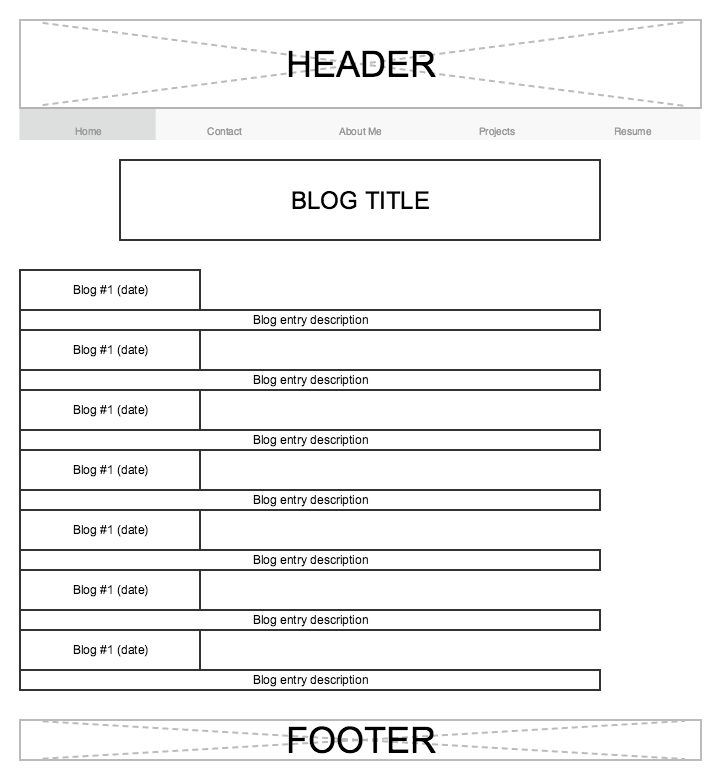

**What is a wireframe?**

A wireframe is a simple mockup of a website and its basic functionality.

**What are the benefits of wireframing?**

Wireframing is an essential part of the planning phase of web design. This way a concrete foundation is set and basic flaws can be argued and fixed within a team before any actual coding has begun.

**Did you enjoy wireframing your site?**

I found wireframing an interesting and essential concept. I don't find creating it from scratch particularly enjoyable.

**Did you revise your wireframe or stick with your first idea?**

I did mockups in several different wireframe building web apps before I found the one that I liked the best (I used Giffly). My design got adjusted a little bit each time. I stuck with a very simple design for my first effort though.

**What questions did you ask during this challenge? What resources did you find to help you answer them?**

I mostly just had questions concerning which boxes and such were acceptible/used for which page elements I browsed through the I ♥ wireframes tumblr and found it useful as a baseline for what should be included in a good wireframe.

**Which parts of the challenge did you enjoy and which parts did you find tedious?**

I enjoyed wireframing once I found a simple wireframing app to use. This excercise is pretty straightforward and nothing stood out as tedious.
